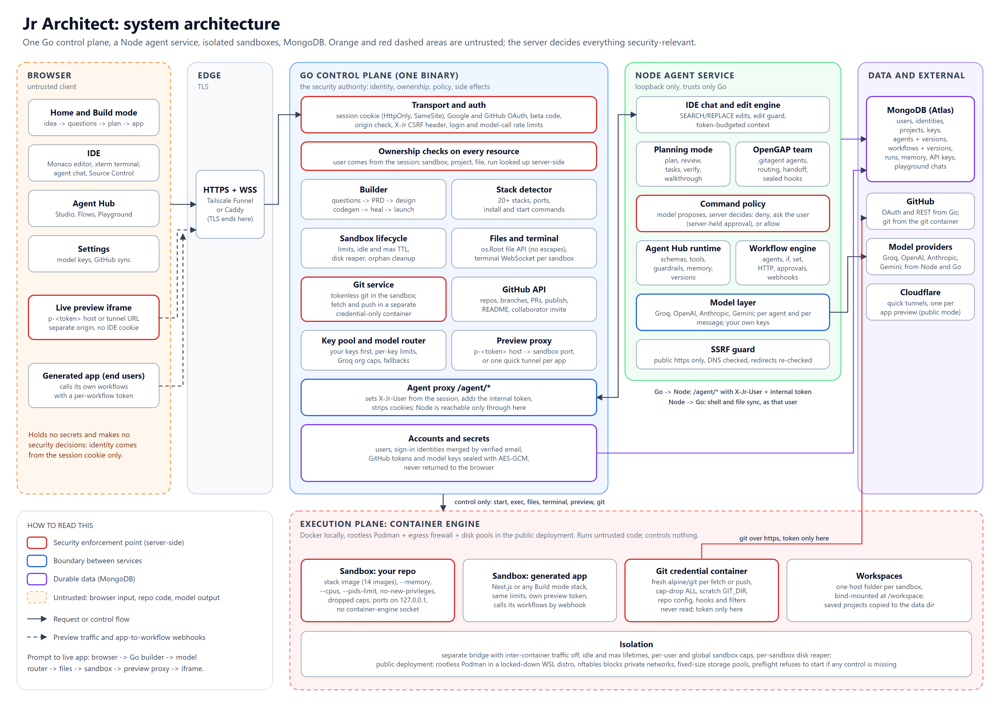
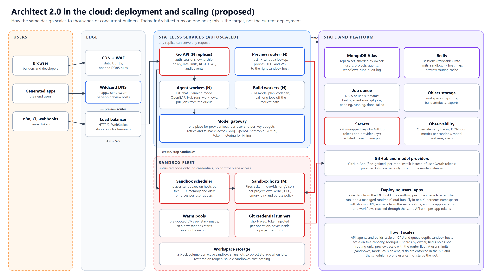

# Jr Architect: architecture and decisions

Jr Architect is an AI app builder for two kinds of people.

- **Someone who doesn't code** describes an idea. Jr Architect asks a few questions and agrees a plan with them, then builds the app, its AI agents and its workflows. It runs the app on a live URL and pushes the code to their GitHub.
- **A developer** opens any GitHub repository in a sandboxed IDE. A team of coding agents works on it under rules the developer sets, and every change goes back to GitHub.

This document covers how it works today, why each part is built the way it is, and how the same design would be deployed and scaled for thousands of users.

Diagrams (in `docs/architecture/`):

## 1. Principles

1. **The backend is the authority.** The browser renders and asks. The Go server decides identity, ownership, limits and every side effect. Who you are comes from the session cookie, never from a field the page sends.
2. **Nothing untrusted holds a secret.** Repository code, model output and the browser are all treated as hostile. Provider keys and GitHub tokens stay on the server, encrypted at rest. The GitHub token is only ever handed to a short-lived git container that runs no repository code.
3. **The model proposes, the server decides.** An agent can suggest an edit or a command. Server-side guards and the user's approval decide whether it happens.
4. **Your model, your key, your code.** Every agent, workflow and chat message can use a different provider. Keys you paste are used before the server's own, and the code you build lands in your GitHub account.
5. **One binary, few moving parts.** A single Go server and a single Node service, which a mid-level engineer can run, read and reason about.

## 2. Components

| Part | Technology | What it owns |
|---|---|---|
| Web UI | Vanilla JS, Monaco, xterm.js, embedded in the Go binary | Home and Build mode, the IDE, Agent Hub (Studio, Flows, Playground), Settings |
| Control plane | Go (`net/http`, gorilla/websocket, Docker SDK and CLI) | Sessions and OAuth, ownership checks, Build mode, the stack detector, the sandbox lifecycle, files and terminal, git and GitHub, previews, the model key pool |
| Agent service | Node 22 (Express, `ws`, gitclaw), loopback only | The IDE chat and edit engine, Planning mode, the OpenGAP agent team and its guards, the command policy, the Agent Hub runtime, the workflow engine, the model layer |
| Execution plane | Docker locally, rootless Podman in the public deployment | One container per project from 14 stack images, plus a separate git credential container for fetch and push |
| Database | MongoDB (Atlas), or JSON files when no database is configured | Users, sign-in identities, projects, provider keys, agents and versions, workflows and versions, runs, agent memory, API keys, playground chats |
| External | GitHub, Groq, OpenAI, Anthropic, Gemini, Cloudflare quick tunnels | Repositories, models, public preview URLs |

## 3. From a prompt to a running app

This is what happens, request by request, when someone types an idea on the home page.

1. **Sign-in.** Google or GitHub OAuth (with a state cookie) or a beta code creates a session. The cookie is `HttpOnly` and `SameSite=Lax`; in production it is also `Secure` and `__Host-` prefixed. Every write needs an `X-Jr` header and a matching `Origin`, so a cross-site form cannot act as the user.
2. **Questions** (`POST /build/questions`). The Go builder asks the model for a few design decisions about the idea, each with a recommended answer. The call spends from the user's hourly model budget.
3. **Plan** (`POST /build/prd`). The answers become a PRD: pages, data, the agents the app needs, and the workflows that chain them. The user can edit the plan before anything is built.
4. **Agents and workflows** (`POST /agent/hub/blueprint`, proxied to Node). The agents are created as versioned definitions (instructions, tools, input and output schemas, guardrails), and the workflows wire them together. Each workflow gets a webhook token. Only the token's hash is stored.
5. **Scaffold** (`POST /build/scaffold`). Go reserves a sandbox slot, checking the per-user and global caps, and answers at once with a build ID. The rest runs in the background:
   - the stack template is copied;
   - the UI is generated in passes (design, then pages);
   - the files are validated (imports, icons, syntax);
   - the container starts from the stack's image.
6. **Healing.** If a page fails to compile or render, the heal loop reads the error, asks the model for a targeted fix, and tries again within a time budget. Fixes that would remove exports are refused, and the fallback file is kept.
7. **Live preview.** The app's port is published on `127.0.0.1` only and reached through the preview proxy. With a preview domain, the host is `p-<token>.<domain>`; in the public deployment it is a Cloudflare quick tunnel per app. The preview runs on a different origin from the IDE, so the app never sees the IDE's cookie. The page polls the build status and shows the app in an iframe as soon as it answers.
8. **GitHub.** If the user connected GitHub and left auto-push on, the server creates a repository, writes a README and safe examples of any secret files, commits, and pushes. The push goes through the git credential container (section 4.6). It then invites the `jr-architect` collaborator.
9. **Using it.** The app calls its own workflows over webhooks with its per-workflow token. The workflows run the agents with the user's chosen models, and each run is stored with its steps.

A developer's path is the same from step 5 onwards, except the source is a repository rather than generated code.

- `POST /run` clones on the host into a fresh workspace, with credential helpers off and submodules off.
- The detector finds the stack, ports and commands, and shows a plan to approve.
- The container starts. The IDE then opens three connections, each checked against the sandbox owner first:
  - the terminal WebSocket (`docker exec` attach);
  - the file API;
  - the agent WebSocket.

## 4. Decisions

### 4.1 Sandboxes

**Choice:** one container per project from a prebuilt stack image. There are 14 images covering 20+ stacks: Node, React, Next.js, Python, Django, Go, Rust, Java, .NET, PHP, Ruby, Bun, Deno, static sites and multi-stack composites.

**Limits:**
- `--memory`, `--cpus` and `--pids-limit`;
- `no-new-privileges` and a reduced capability set;
- ports bound to `127.0.0.1`;
- a bridge network with inter-container traffic off;
- no container-engine socket inside the sandbox;
- idle and maximum lifetimes, a per-sandbox disk limit, and per-user and global caps.

The public deployment adds rootless Podman in a locked-down WSL distro: Windows interop is off and the C: drive is root-only. On top of that it adds an nftables egress firewall that blocks private networks, and fixed-size storage pools. A preflight check refuses to start if any of these controls is missing.

**Why:** containers start in seconds and give real installs, real dev servers and hot reload. They are also cheap on one machine, and the stack images keep startup fast and predictable.

**What I would change at scale:** Firecracker microVMs (or gVisor) per project, with a scheduler and warm pools (see section 6). A shared kernel is the weakest part of container isolation when the code is hostile.

### 4.2 The agent harness

There are three harnesses, all on one rule: the model proposes, the server checks and then executes.

- **IDE chat and edit engine.**
  - The model answers with SEARCH/REPLACE blocks against files the server picked (named files, style files for visual changes, and search hits).
  - The blocks are applied by the server.
  - An edit guard refuses `.env`, lockfiles and anything that looks like a secret.
  - Context is budgeted to the provider's per-request token limit, and a 413 is retried with less context.
- **Planning mode.**
  - The model writes a plan with tasks and verification steps.
  - The user reviews it, comments on it, and proceeds.
  - Each task runs as an edit.
  - Each verification command waits for an approval that only the server holds. The browser can only say yes or no to a command the server already has.
  - The run ends with a walkthrough of what changed.
- **OpenGAP agent team** (`.gitagent/agents/*`), compatible with GitAgent.
  - Agents own files and are routed by `@name`, by ownership, or by a classifier.
  - They get a fixed number of attempts and hand off through a compiled brief of verified and claimed work.
  - Guards in `hooks/*.yaml` run on the real content. Four guards are sealed in code (secret scan, no force push, protected reads, no sudo). A guard file that fails to parse stops the run instead of weakening it.
- **Agent Hub runtime** (agents behind workflows and apps).
  - Each agent has typed input and output schemas.
  - Input is coerced to those schemas.
  - Tools are on an allowlist per agent, and `web.fetch` only reaches allowed domains over public https, with DNS checked.
  - Persistent memory has a cap.
  - Human approval can be required for tools or for the final output.
  - A wrong-shaped answer is retried with a correction.

**Command policy.** When the coding agent wants to run a shell command, `command-policy.js` decides first:
- **Refused:** git internals, git configuration and remotes, `/proc/*/environ`, the container engine, `sudo`, SSH keys.
- **Asks the user:** network tools, piping into an interpreter, dependency changes, `rm -rf`, `git reset --hard`, background processes.
- **Allowed:** everything else, such as tests and builds.

The repository's OpenGAP hooks are folded into the same decision, and every decision is logged. This is defence in depth. The real boundaries are the container and keeping credentials out of it.

**Recovering from errors:**
- **Build mode:** the heal loop.
- **Models:** per-key retries and fallbacks.
- **Hub agents:** schema retries.
- **IDE chat:** the 413 retry.
- **Stopping:** the Stop button cancels the remaining tasks and declines any pending command.

### 4.3 Model-agnosticism

- Providers sit behind one model layer in Node: Groq, OpenAI, Anthropic and Gemini. Ids look like `provider:model`, and tool calls are normalised by gitclaw.
- A model can be chosen per chat message, per agent and per workflow node.
- `auto` picks the strongest provider the user has a key for.
- Keys pasted in Settings are stored encrypted (in MongoDB or the data folder) and used before the server's own.
- On the Go side, Build mode's code generation uses a Groq key pool. It tracks each key's per-minute token window and each organisation's request cap, drops keys the provider rejects, and rotates across keys.
- Switching models changes nothing else, because agents are stored as model-independent definitions.

**At scale:** one model gateway service in front of all providers (section 6), so budgets, metering and fallbacks live in one place. Build mode would then use the same multi-provider path as the agents.

### 4.4 How the browser talks to the backend and the sandbox, and the live preview

- **REST** for state and actions. Two WebSockets:
  - `/terminal/ws`, which attaches to an interactive shell inside the owner's container;
  - `/agent/ws`, which streams agent tokens, tool steps, plan artefacts and approval requests.
- The browser never names a user and never reaches Docker. It names a container, and the server checks that container belongs to the session's user before anything happens.
- **Files.** File edits go to the host workspace through `os.Root`, which refuses `../` and symlinks out of the project. They are then written through into the container, so dev servers with hot reload pick them up across the Docker Desktop bind mount.
- **Preview.** The app runs on its own port in the sandbox and is reached through the preview proxy or a quick tunnel, on a separate origin from the IDE. Redirects and cookie domains from the app are rewritten so they stay on the preview host.

### 4.5 The proxy

The proxy sits inside the Go server, in front of everything, in this order: preview dispatch, then the origin guard, then authentication, then the request log, then the routes.

- **Preview proxy.** A `p-<token>` host is resolved server-side to a sandbox and port. The token is random and never the container name. HTTP and WebSocket are proxied to `127.0.0.1:<port>`. A preview host can never reach the IDE or its API.
- **Agent proxy.** `/agent/*` is forwarded to Node on loopback. The proxy sets `X-Jr-User` from the session, overwriting anything the client sent. It adds the internal token and strips cookies. Node refuses any request without that token, and Go refuses Node's callbacks unless they come from loopback with the token.

### 4.6 GitHub integration

- **Sign-in and connection.** GitHub OAuth for sign-in or for linking an existing account (accounts merge on verified email), or a pasted token. The token is sealed with AES-GCM using a key derived from the session secret, and is never returned to the browser.
- **Clone.** On the host, with credential helpers reset and submodules off. Cloning does not run repository hooks.
- **Commit, status, log and rebase** run in the sandbox **without** the token. The function that runs git there only accepts an environment type that cannot carry one, so the compiler enforces it.
- **Fetch and push** run in a fresh `alpine/git` container per operation, with `--cap-drop ALL` and no repository code running.
  - Git works in a scratch git directory whose config is ours.
  - The workspace's objects are borrowed as data, so its `.git/config`, hooks, filters and proxies are never read.
  - Results come back through `os.Root`.
  - A test plants every known trap, proves the old path leaked the token, and proves the new path does not (ADR-004).
- **Where a push goes.** The server's record of the repository decides this, not the workspace's `origin`.
- **Publishing.** Publish creates the repository, writes a README, pushes, sets topics, and invites the collaborator. Invites can be auto-accepted with the collaborator's own token.

### 4.7 Deploying the user's app

**Today:**
- every app runs live in its sandbox with a public preview URL;
- its code is in the user's GitHub repository, ready for any host that deploys from GitHub (Vercel, Netlify, Render);
- its agents and workflows keep running in Jr Architect behind per-workflow tokens.

**Proposed:**
- a one-click deploy builds an image in the sandbox and pushes it to a registry;
- it then runs on a managed runtime (Cloud Run, Fly.io or a Kubernetes namespace) with its own URL;
- environment variables come from the secrets store;
- the app reaches its agents through the same API with per-app tokens.

### 4.8 Deploying Jr Architect itself

**Today:** one Windows laptop running a hardened WSL distro.
- The Go binary and the Node service run as a systemd user service.
- Containers are rootless Podman.
- Tailscale Funnel gives the public HTTPS address.
- Data lives in MongoDB Atlas.
- A scheduled task keeps the service up, and `/health` (liveness) and `/ready` (engine, agent, disk, capacity) report state.

The cloud version is section 6.

### 4.9 Persistence

MongoDB holds everything durable, and every record has an id.

- **Go collections:** `users`, `identities`, `projects`, `provider_keys`.
- **Node collections:** `agents` and `agent_versions`, `workflows` and `workflow_versions`, `runs`, `agent_memory`, `api_keys`, `playground_threads`.
- **Encryption and hashing:** secrets are sealed before storage; API keys are stored as hashes only.
- **Without a database:** the same code falls back to JSON files and git repositories, so tests and local development need no database.
- **First connection:** existing files are imported once.
- **Not in the database:**
  - project source stays on disk next to the sandbox;
  - in-flight state (running sandboxes, open plans) lives in process memory, and orphans are reaped by label on restart.

## 5. Security model in short

| Boundary | Enforced by |
|---|---|
| Browser to server | Session cookie, origin check and `X-Jr` header, ownership lookup on every resource, rate limits on login and model calls |
| Server to agent service | Loopback, the internal token, identity set by the proxy |
| Model to system | Edit guard, OpenGAP hooks, command policy with server-held approvals, Hub tool allowlists and the SSRF guard |
| Repository code to secrets | Container isolation; the GitHub token never enters the sandbox; keys never leave the server |
| Repository to host files | `os.Root` for every file API; symlink-checked paths in the agent service |

`docs/PRODUCTION_AUDIT.md` lists every weakness found, with a severity. The two most serious are fixed: the GitHub token reaching the sandbox (critical) and the unguarded agent shell (high). The open items are listed honestly there:
- revocable sessions;
- an allowlist for clone hosts;
- terminal WebSocket limits;
- security headers;
- one central authorization function.

## 6. Scaling to thousands of users (proposed)

- **Edge.**
  - A CDN and WAF serve the static UI and absorb abuse.
  - Wildcard DNS (`*.app.example.com`) sends preview hosts to a preview router fleet.
  - A load balancer carries the API and WebSockets, sticky only for terminals.
- **Stateless services, autoscaled.**
  - The Go API: sessions, ownership, policy, rate limits, audit events.
  - Agent workers and build workers pull jobs from a queue (NATS or Redis Streams). Long work never depends on one HTTP request staying open, and every job has a state: pending, running, succeeded, failed, cancelled or timed out.
  - A model gateway holds the provider keys, per-user and per-key budgets, fallbacks and token metering.
- **Sandbox fleet.**
  - A scheduler places Firecracker microVMs on hosts by free CPU, memory and disk, and enforces per-user quotas.
  - Warm pools per stack image make a new sandbox start in about a second.
  - Workspaces are block volumes, snapshotted to object storage when idle and restored on reopen, so idle sandboxes cost nothing.
  - Git credential runners stay separate from project sandboxes.
- **State.**
  - MongoDB Atlas, sharded by owner, for durable records and the audit log.
  - Redis for revocable sessions, rate limits and the sandbox-to-host routing map.
  - Object storage for snapshots and build artefacts.
  - Secrets in KMS.
  - A GitHub App with fine-grained per-repository installs instead of user OAuth tokens.
  - OpenTelemetry traces, JSON logs and metrics per sandbox, per model and per user.
- **How it scales.**
  - The API, agents and builds scale on CPU and queue depth.
  - Sandbox hosts scale on free capacity.
  - Previews scale with the router fleet.
  - The database shards by owner.
  - Every per-user limit (sandboxes, model calls, tokens, disk) is enforced in the API and the scheduler, so one user cannot starve the rest.

## 7. Trade-offs I accepted

- **Containers instead of microVMs today.** Faster to build and run on one machine; weaker against kernel exploits. Mitigated in the public deployment with rootless Podman, an egress firewall and disk pools.
- **A single Go binary.** Simple to deploy and reason about. The in-memory sandbox registry means a restart reaps running sandboxes instead of resuming them.
- **Pattern-based command policy.** Catches the realistic attacks and makes the agent ask before risky actions. It is not a sandbox and is not treated as one.
- **Build mode generation is Groq-only today.** Fast and cheap on a free tier. The agent service is already multi-provider, and the model gateway would unify the two.

## 8. Where to look in the code

| Area | Path |
|---|---|
| Routes and middleware order | `internal/server/routes.go` |
| Sessions, OAuth | `internal/server/auth.go`, `internal/server/oauth.go` |
| Sandbox lifecycle and limits | `internal/core/docker.go`, `internal/core/lifecycle.go`, `internal/server/sandbox.go` |
| File API | `internal/server/files.go`, `internal/core/workspace.go` |
| Preview proxy | `internal/server/preview.go`, `internal/core/preview.go`, `internal/core/tunnel.go` |
| Git and GitHub | `internal/server/gitops.go`, `internal/server/gitremote.go`, `internal/server/github.go`, `internal/server/publish.go` |
| Build mode | `internal/builder/` |
| Agent service, edit engine, command policy | `agent-services/server.js`, `agent-services/command-policy.js` |
| Planning mode, OpenGAP | `agent-services/planner.js`, `agent-services/opengap/` |
| Agent Hub and workflows | `agent-services/hub/` |
| Database | `internal/core/db.go`, `agent-services/hub/db.js` |
| Public deployment hardening | `deploy/wsl/` |
| Audit and decisions | `docs/PRODUCTION_AUDIT.md`, `docs/ADR/` |
