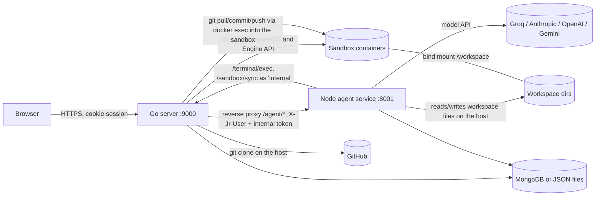

# Production audit

Phase 0 of the hardening programme. Nothing in the code was changed to write this; every claim below names the file it comes from. Severity is about what an attacker can actually reach today, not how the code looks.

Scope read: `main.go`, `internal/{core,server,builder,detect,gitagent}`, `agent-services/` (server, planner, hub, opengap, workspace-fs, llm), `web/`, `deploy/`, `.github/workflows/`, `sandbox-images/`, `builder-template/`.

## 1. Current architecture



- One Go binary serves the UI (embedded `web/`), the REST API, the terminal WebSocket, preview routing and the container lifecycle (`internal/server`, `internal/core`).
- The Node service is a child process on loopback. It runs the IDE chat, Planning mode, OpenGAP agent teams, the Agent Hub and workflows (`agent-services/`).
- Sandboxes are Docker containers (local) or rootless Podman (the WSL deployment, `deploy/wsl`). The workspace is a host directory bind-mounted at `/workspace`.

## 2. Current trust boundaries

| Boundary | Enforced by | Notes |
|---|---|---|
| Browser to Go | `RequireAuth` (session cookie), `OriginGuard`, `X-Jr` header on writes (`internal/server/auth.go`, `routes.go`) | Real boundary. |
| Go to Node | `X-Jr-Internal` token, loopback bind (`server.js` `fromJrArch`) | Real when the token is set; `fromJrArch` returns true when the token is empty. Go always generates one when it spawns Node (`config.go`). |
| Node to Go callbacks | Same token, loopback and no `X-Forwarded-For` (`auth.go` `isInternalCall`) | Node calls Go as `InternalUser`, which `CanUse` treats as owning every sandbox. |
| Sandbox to host | Container isolation, `no-new-privileges`, 5 dropped caps, pids/mem/cpu limits (`core/docker.go`) | Strong on the WSL deployment (rootless Podman + nftables egress, `deploy/wsl/harden.sh`). Weak under Docker Desktop: root in the container, host loopback and LAN reachable. |
| Model to system | Edit guard (`guardEditBlocks`), OpenGAP hooks, Planning-mode command approval | Partial: the agentic `shell` tool is not behind either (see W-04). |
| GitHub token to untrusted code | Intended: "token never leaves the server" | **Broken** during pull/commit/push (see W-01). |

## 3. Frontend capabilities

The browser can: start a sandbox from any http(s) repo URL, read/write/rename/delete any file in its own sandbox, run any command in its own container (`/terminal/exec`, `/terminal/ws`), drive the agent over `/agent/ws`, run Build mode, manage GitHub (pull, push, PR, publish, unshallow), manage Hub agents/workflows and paste provider keys.

What the browser sends that the backend uses for identity: nothing. The user comes from the session cookie; the proxy overwrites any client `X-Jr-User` (`proxy.go`). The browser does choose the **container name** in every sandbox call; Go then checks ownership (`ownedSandbox`), and Node checks `session.owner` (`mayUse`).

## 4. Backend capabilities

Go: container lifecycle, file I/O through `os.Root`, git, GitHub API, OAuth, sessions, previews/tunnels, Build mode generation. Node: model calls, prompt construction, edit application to the host workspace, OpenGAP guards, Hub agent runtime with tools (`repo.read`, `web.fetch`, `memory.save`, HTTP nodes), workflows.

## 5. Security-sensitive operations

Clone (host git), container start, terminal attach/exec, file writes, agent edits and shell, git commit/push/PR/publish, collaborator invites, OAuth callbacks, key storage, Hub webhooks (`/hooks/...` with bearer tokens), workflow HTTP nodes.

## 6. Authentication

- Beta code (`JR_BETA_CODE`, constant-time compare, 10 attempts/min/IP) and Google/GitHub OAuth with a state cookie (`oauth.go`).
- Accounts merge on verified email (`core/accounts.go` `ResolveUser`).
- Local mode with no login maps every request to user `local`; config refuses a public origin without a login (`config.go` `Validate`).

## 7. Authorization

- Ownership is the only model: a sandbox, project, agent, workflow or run belongs to one user ID.
- Go: `ownedSandbox` per handler; projects keyed by owner; GitHub link per user.
- Node: `mayUse(user, session)`; Hub routes scope every query by `x-jr-user`.
- There is no central `Authorize()`; each handler calls the check itself. It is applied consistently in the handlers read, but nothing prevents a new handler from forgetting it.
- `InternalUser` bypasses ownership entirely, so Node is a confused deputy: whatever container Node names, Go acts on.

## 8. Sessions

- Stateless HMAC cookie: `base64(user|expiry).hmac` (`auth.go`), 7 days, `HttpOnly`, `SameSite=Lax`, `Secure` and `__Host-` prefix when the origin is https.
- No server-side session record: logout only clears the cookie, so a copied cookie stays valid until it expires. The only global revocation is rotating `JR_SESSION_SECRET`.
- CSRF: `SameSite=Lax` + required `X-Jr` header on unsafe methods + Origin check. Adequate.

## 9. Filesystem

- Go file APIs: `ResolveInWorkspace` (lexical + `EvalSymlinks`) and then `os.Root` for the actual I/O, which refuses to follow links out of the root. Strong.
- Node: `workspace-fs.js` resolves real paths and, on Linux only, re-verifies the opened fd. On Windows/macOS there is a check-then-use window while the container can rewrite the tree concurrently (W-10).
- Error responses return `err.Error()` from filesystem calls, which can include host paths (W-14).

## 10. Sandbox

- `docker run` with `--memory`, `--cpus`, `--pids-limit`, `no-new-privileges`, `nofile` ulimit, five caps dropped, ports bound to 127.0.0.1, isolated bridge with ICC off (`core/docker.go`).
- All 14 sandbox images run as **root** (no `USER` in any `sandbox-images/*/Dockerfile`). Default seccomp, writable root filesystem, default capability set otherwise.
- Disk: storage pools on WSL; elsewhere only a periodic size reaper (`lifecycle.go`).
- No Docker socket is mounted into sandboxes. Good.
- Registry of sandboxes is in memory; restart reaps orphans by label (`ReapOrphans`).

## 11. GitHub token handling

- Tokens are sealed with AES-GCM using a key derived from the session secret (`accounts.go`), never returned by `/auth/me` or `/github/status`, and passed to git as an `http.extraheader` through `GIT_CONFIG_*` env vars rather than argv.
- Clone runs on the host with credential helpers reset (`gitops.go` `hostClone`).
- **Pull, commit, push and log run `git` inside the user's sandbox container with the token in that process's environment** (`gitops.go` `runGit`). See W-01. Fixed: fetch and push now run in a separate, credential-only git container (`gitremote.go`, ADR-004).

## 12. Agent security

- IDE chat edits: the model proposes SEARCH/REPLACE blocks; `guardEditBlocks` refuses `.env`, lockfiles and secret-shaped content; OpenGAP `checkEdit` hooks run when a team is installed.
- Planning mode: verification commands pass `checkCommandLine` and wait for a server-held approval keyed to the connection (`planner.js` `decide`). Good: the browser only answers yes/no for a command the server holds.
- Agentic chat: the model gets `read`, `write`, `search_code` and `shell` (`AGENT_ALLOWED_TOOLS`). `shell` runs any command in the container with **no guard and no approval** (`server.js` `makeShellTool`).
- Hub agents: declared tools and per-agent domain allowlists; `web.fetch` goes through `checkPublicUrl` (W-09).
- Capabilities are a global env list, not per agent or persona.

## 13. WebSocket security

- `/terminal/ws`: ownership checked before upgrade, origin checked. No read limit (gorilla default is unlimited), no idle timeout, no ping, no per-user connection cap, no audit event (`terminal.go`).
- `/agent/ws`: `verifyClient` checks origin and internal token; `bind` checks `session.owner`.

## 14. API validation

Hand-rolled: `json.Unmarshal` into ad-hoc structs with `LimitReader`. Most handlers bound body size; `runHandler` uses `json.NewDecoder` on an unbounded body. Error format is `{"error": "..."}` with no code or request ID.

## 15. Rate limiting

Present: login (10/min/IP), model calls per user per hour (Go `AllowLLM`, Node `allowLLM`), concurrent sandboxes (global and per user), two concurrent Hub runs per user. Absent: clone/sandbox creation rate, terminal connections, file operations, GitHub operations, OAuth callbacks.

## 16. Observability

`core.Logf` prefixed text lines and a request log. `/health` and `/ready` exist (`/ready` checks engine, agent, disk, capacity). No request IDs, no structured JSON, no metrics, no audit trail.

## 17. Persistence

MongoDB when `MONGODB_URI` is set (users, identities, projects, keys, agents, workflows, runs, memory, API keys, chats), JSON files otherwise. Sandboxes, Node sessions, Planning-mode plans, draft runs and rate-limit windows live in memory only.

## 18. Concurrency

Mutex-guarded maps in Go; per-key promise locks in Node (`withLock`). Long jobs (clone, detect, build, heal, agent turns) run in goroutines or async functions tied to process memory; a restart loses them and the janitor reaps their containers.

## 19. Error handling

Mixed: many handlers return `err.Error()` verbatim; several operations report success as 200 with an `exitCode` (`/terminal/exec`), which is intentional. Some errors are swallowed (`SyncBytes` ignores failure).

## 20. Testing

Go unit tests for parsing, auth, OAuth, ownership of approve, static lint, gitops parsing; Node tests for the edit engine, planner, OpenGAP, Hub, workflows, DB. Few negative cross-user tests over HTTP; none for the terminal WebSocket; no integration test against a real container.

## 21. Deployment assumptions

Single host. Public deployment = WSL + rootless Podman + nftables egress + storage pools + Tailscale Funnel (`deploy/wsl`). Local = Docker Desktop. TLS terminates at Funnel. CI: one GitAgent review workflow, no build/test/lint/secret scan job.

## 22. Weaknesses

| ID | Severity | Weakness | Where | Why it matters |
|---|---|---|---|---|
| W-01 | CRITICAL (fixed, ADR-004) | GitHub token enters the untrusted sandbox on pull/commit/push/log | `gitops.go` `runGit` (`docker exec ... -e GIT_CONFIG_VALUE_n`) | Code in the container (a dev server, a `postinstall` daemon, or the agent `shell` tool steered by prompt injection) runs as the same root user, so it can read `/proc/<pid>/environ` of the git process. It can also pre-plant `.git/hooks/pre-push`, `core.fsmonitor`, `http.proxy` or `includeIf` in `.git/config`, which git honours. Any of these leaks a token with `repo` scope over **all** the user's repositories. |
| W-02 | HIGH | Agentic `shell` tool is unguarded | `server.js` `makeShellTool` | Model-chosen commands run with no OpenGAP check and no approval, so prompt injection in repo files can tamper `.git` (chains into W-01) or exfiltrate source over the open network. |
| W-03 | HIGH | Docker Desktop mode: root containers that can reach the host and LAN | `core/docker.go`, all images | `host.docker.internal` and the LAN are reachable, and processes run as root with the default capability set. A hostile repo can probe other services on the developer's machine. The WSL/Podman deployment does not have this problem. |
| W-04 | HIGH | Sessions cannot be revoked | `auth.go` | A stolen cookie works for up to 7 days; logout does not end it server-side. |
| W-05 | HIGH | Clone SSRF | `core/workspace.go` `ValidateRepoURL` | Any http(s) host is accepted, including 127.0.0.1, private ranges and cloud metadata. Errors echo git's last line back to the user. Mitigated on WSL by the egress firewall, open elsewhere. |
| W-06 | MEDIUM | No central authorization; `InternalUser` bypasses ownership | `core/user.go` `CanUse`, every handler | Correct today by discipline. One forgotten `ownedSandbox` in a new handler is a cross-user hole; Node bugs become Go privileges. |
| W-07 | MEDIUM | Terminal WebSocket has no read limit, idle timeout, ping or connection cap | `terminal.go` | Memory and connection exhaustion; no record of who attached when. |
| W-08 | MEDIUM | No security headers (CSP, nosniff, frame-ancestors, Referrer-Policy, HSTS) | none found in `internal/` | XSS in any UI string would run with full session power; the IDE can be framed. |
| W-09 | MEDIUM | DNS rebinding in Hub `web.fetch` / workflow HTTP nodes | `hub/runtime.js` `checkPublicUrl` | Resolution is checked, then `fetch` resolves again. Per-agent domain allowlists narrow it. |
| W-10 | MEDIUM | Node workspace guard is check-then-use outside Linux | `workspace-fs.js` | The container can swap a path for a symlink between check and open. Linux verifies the fd. |
| W-11 | MEDIUM | No per-agent capability model | `AGENT_ALLOWED_TOOLS` | Every IDE persona gets every tool; least privilege is not expressible. |
| W-12 | MEDIUM | Long operations live only in process memory | sandbox registry, planner, Build mode | Restart loses state; the browser sees jobs vanish rather than fail. |
| W-13 | MEDIUM | Gaps in rate limiting | see section 15 | Clone, terminal, file and GitHub operations can be hammered. |
| W-14 | LOW | Internal error text reaches the client | file and git handlers | Host paths and tool output in error messages. |
| W-15 | LOW | Unbounded request body on `/run` | `sandbox.go` `runHandler` | `json.NewDecoder(r.Body)` without a limit. |
| W-16 | LOW | No structured logs, request IDs or audit events | `core.Logf` | Incidents cannot be reconstructed. |
| W-17 | LOW | CI runs no build, tests, lint or secret scan | `.github/workflows` | Regressions and leaked keys reach `main` unchecked. |
| W-18 | LOW | A non-loopback listen address without a login is not refused | `config.go` `Validate` | `JR_LISTEN_ADDR=0.0.0.0:9000` with no auth and no public origin exposes everything as user `local`. |

What is already solid and should be kept: `os.Root` file I/O, ownership checks on every sandbox handler read, proxy-overwritten identity headers, origin + custom-header CSRF defence, sealed GitHub tokens with redaction in errors, server-held command approvals, the WSL hardening (rootless Podman, egress firewall, storage pools, preflight).

## 23. Recommended target architecture

```mermaid
flowchart TB
  B[Browser: untrusted presentation layer] -->|HTTPS + WS, session cookie| T
  subgraph GO[Go server: the security authority]
    T[Transport: auth, CSRF, origin, request ID, limits, headers] --> P[Policy: Authorize(actor, action, resource)]
    P --> A[Application services: sandboxes, files, git, projects, operations]
    A --> I[Infrastructure: container engine, host git, GitHub API, storage]
    AU[Audit log]
    T --- AU
    P --- AU
  end
  NODE[Node agent service: proposes actions] -->|tool calls as the acting user, never 'internal'| T
  I -->|start/exec, no secrets inside| C[(Sandbox: untrusted code)]
  I -->|git with credentials, outside any sandbox| GH[(GitHub)]
```

Principles, in priority order:

1. **Credentials never enter an execution environment that runs repository code.** Git operations that need the token run in a short-lived, separate container with no repository code executing, hooks disabled, repo config ignored for dangerous keys, and only the workspace mounted.
2. **One authorization point.** `Authorize(ctx, actor, action, resource)` in Go; handlers resolve the resource server-side and call it; Node acts as the end user, not as `internal`.
3. **The model proposes, the policy decides.** Every agent tool goes through the same guard and capability check as Planning mode; risky commands need a server-held approval.
4. **Sessions are server records** that logout and admins can revoke.
5. **Operations have server-owned lifecycle** (pending, running, succeeded, failed, cancelled, timed out) persisted next to the other metadata.

Recommended order: W-01, then W-02, W-04, W-05, W-07, W-08, W-06, W-03, followed by the medium/low items, observability and CI.
